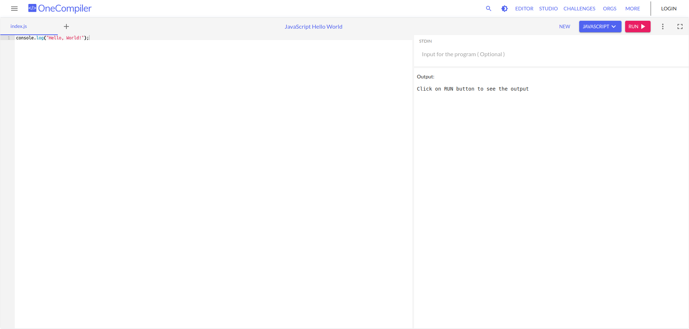

# Code source de la partie I

Ce dépôt contient tous les exemples illustrés dans chaque chapitre de la **partie I**
du livre. Chaque chapitre dispose d'un dossier dédié à ses exemples.

## Exécuter soi-même le code

Les exemples sont principalement des scripts en _JavaScript_, mais il y a également des exemples en _Python_, en _C_, et en _C++_.

Chaque langage ayant ses propres prérequis, pour tester les exemples vous-même, il est possible d'utiliser la plateforme [One Compiler](https://onecompiler.com/).

Cette plateforme permet d'ouvrir un éditeur de texte depuis un navigateur Web, d'y éditer ou de coller le code source et de l'exécuter. Ainsi, il n'est pas nécessaire d'installer un environnement de développement complet sur votre ordinateur pour chaque langage de programmation.

| Langage       | Lien                                  |
| ------------- | ------------------------------------- |
| JavaScript    | https://onecompiler.com/javascript    |
| Python        | https://onecompiler.com/python        |
| C             | https://onecompiler.com/c             |
| C++           | https://onecompiler.com/cpp           |

## Présentation de l'interface graphique

La partie à gauche de l'interface est l'éditeur de texte. Il permet d'écrire ou d'y coller le
code source que nous souhaitons tester.

La partie à droite présente deux section, _l'input_ et _l'output_. L'input (STDIN) est
inutile pour les exemples de cette partie. En revanche, après chaque exécution, la section
output affichera les messages produits par le code source.
